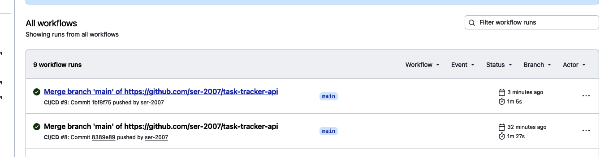
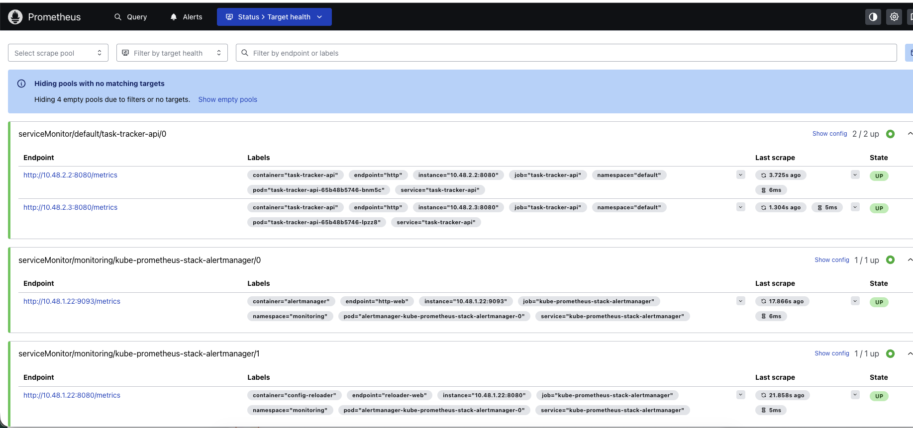
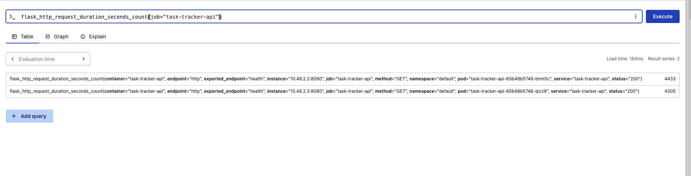
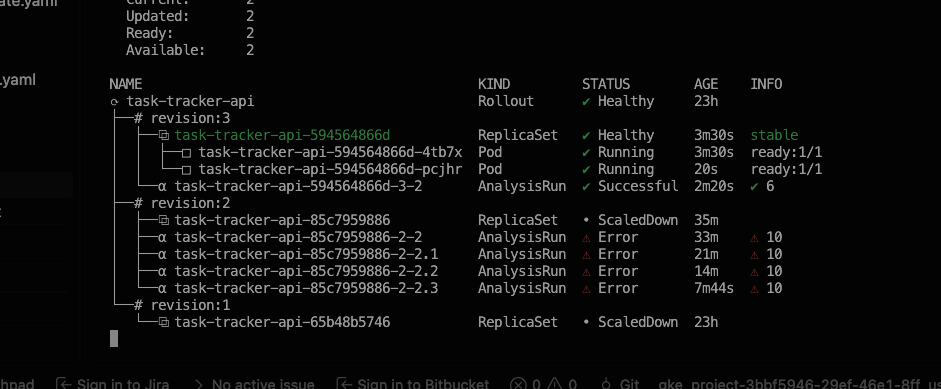

# Task Tracker API — GitOps CI/CD with Canary Rollout

A small Flask CRUD service deployed to GKE through a full GitOps pipeline:
GitHub Actions builds and scans the image, ArgoCD syncs the manifests, and
Argo Rollouts drives a metrics-gated canary release backed by live
Prometheus queries scoped to the canary pods themselves.

## Architecture

```
developer push → GitHub Actions (test → build → Trivy scan → push to GHCR)
                → bump image tag in k8s/rollout.yaml, commit back to main
                → ArgoCD detects drift, syncs k8s/ to the cluster
                → Argo Rollouts runs a canary release:
                    25% traffic → pause → AnalysisRun (Prometheus query,
                    scoped to the canary's own pods, gated on success rate
                    + p95 latency) → 50% → pause → 100%
```

**Stack:** Flask + SQLite, `prometheus-flask-exporter`, Docker, GitHub
Actions, Trivy, GHCR, GKE, ArgoCD, Argo Rollouts, kube-prometheus-stack.

## Service

- `GET/POST /tasks`, `GET /tasks/<id>`, `POST /tasks/<id>/complete`,
  `/health`, `/version`
- SQLite-backed, 7 passing unit tests (`tests/test_app.py`)
- `/metrics` exposes Prometheus counters and latency histograms per
  endpoint/status — this is what the AnalysisTemplate queries during a
  rollout, so the canary gate runs against real request data, not a stub

## Repository layout

```
app.py                          Flask service
tests/test_app.py               Unit tests
Dockerfile
.github/workflows/ci-cd.yml     CI/CD pipeline
k8s/rollout.yaml                Argo Rollouts canary spec
k8s/analysis-template.yaml      Prometheus-backed success-rate/latency gate
k8s/servicemonitor.yaml         Prometheus scrape config
argocd/application.yaml         ArgoCD Application (automated sync)
```

## Setup

### 1. Argo Rollouts controller

```bash
kubectl create namespace argo-rollouts
kubectl apply -n argo-rollouts --server-side \
  -f https://github.com/argoproj/argo-rollouts/releases/latest/download/install.yaml
kubectl get pods -n argo-rollouts
```

The `analysistemplates.argoproj.io` CRD is large enough that a plain
`kubectl apply` fails (`metadata.annotations: Too long: may not be more than 262144 bytes`, from the client-side `last-applied-configuration`
annotation). `--server-side` applies directly against the API server and
avoids the limit.

Install the CLI plugin (macOS, Homebrew):

```bash
brew install argoproj/tap/kubectl-argo-rollouts
```

A manually downloaded binary can mismatch the host architecture and fail
with `exec format error`; Homebrew avoids that.

### 2. Prometheus (kube-prometheus-stack)

```bash
helm repo add prometheus-community https://prometheus-community.github.io/helm-charts
helm repo update
kubectl create namespace monitoring
helm install kube-prometheus-stack prometheus-community/kube-prometheus-stack \
  --namespace monitoring \
  --set grafana.enabled=false \
  --set prometheus.prometheusSpec.resources.requests.memory=256Mi \
  --set prometheus.prometheusSpec.resources.limits.memory=512Mi
```

Grafana is disabled: the AnalysisTemplate queries Prometheus directly over
PromQL, so a dashboard UI isn't required for this pipeline, and the
bundled Grafana pod was unstable on the cluster's initial node sizing.

### 3. Image registry and CI/CD

1. Push this repository to `ghcr.io`-backed GitHub Actions (Settings →
   Actions → Workflow permissions → **Read and write permissions**, so CI
   can push images and commit manifest updates back to `main`)
2. Push to `main` and watch the Actions tab: `test` → `build-and-push`
   (Docker build, Trivy scan, push to GHCR) → `update-manifest` (bumps the
   image tag in `k8s/rollout.yaml` and commits it back)



### 4. ArgoCD Application

```bash
kubectl apply -f argocd/application.yaml
kubectl get application task-tracker-api -n argocd
```

`syncPolicy.automated` (prune + selfHeal) keeps the cluster matched to
`k8s/` without manual syncs.

### 5. ServiceMonitor

```bash
kubectl apply -f k8s/servicemonitor.yaml
kubectl port-forward -n monitoring svc/kube-prometheus-stack-prometheus 9090
```

Confirm the target is up and the `job` label matches what
`k8s/analysis-template.yaml` queries:





### 6. Canary rollout

```bash
kubectl argo rollouts get rollout task-tracker-api --watch
```

A push to `main` that changes the app triggers CI/CD, which updates the
image tag, which ArgoCD syncs, which starts the canary. Steps: `25%` →
60s pause → AnalysisRun (Prometheus-gated, scoped to the canary pods) →
`50%` → 60s pause → `100%`.



### 7. Rollback proof

A deliberately broken revision (`FAULT_RATE` env var, injecting a ~50%
error rate into `/health`) was shipped to the canary. The AnalysisTemplate
correctly measured the canary's degraded success rate, failed the gate,
and Argo Rollouts aborted the rollout automatically — the stable revision
kept serving 100% of traffic throughout, with zero manual intervention:

```
NAME                                       KIND         STATUS      AGE    INFO
⟳ task-tracker-api                         Rollout      ✖ Degraded  30h
├──# revision:8
│  └──⧉ task-tracker-api-c85f79949         ReplicaSet   • ScaledDown  canary
│     └──α task-tracker-api-c85f79949-8-2  AnalysisRun  ✖ Failed    ✓ 2, ✗ 2
└──# revision:7
   └──⧉ task-tracker-api-598cc795bb        ReplicaSet   ✔ Healthy   stable
      ├──□ ...-czdpj                       Pod          ✔ Running   ready:1/1
      └──□ ...-qmn8z                       Pod          ✔ Running   ready:1/1
```

The broken revision was then reverted and removed from the deployment
history.

---

## Operational notes

Real issues hit and resolved while building this out, kept here as a
working incident log rather than a sanitized happy path.

**CRD size limit on install.** `kubectl apply` failed on the Argo Rollouts
CRDs with a 262144-byte annotation limit. Fixed with
`kubectl apply --server-side`.

**Initial node capacity was insufficient for any real workload.** On the
smallest available node size, mandatory GKE system add-ons (`kube-dns`,
`gke-metrics-agent`, `kube-state-metrics`, CSI drivers) alone consumed
~99% of allocatable memory before any application workload was scheduled.
Disabling individual add-ons (e.g. Cloud Logging) didn't help — GKE's
reconciler backfilled the freed capacity with another managed component
within seconds. Resolved by sizing the node pool for the actual workload
(ArgoCD + Argo Rollouts + kube-prometheus-stack + the application), which
also required a second resize once all of those were running together
and the first upsize still left CPU requests at ~97% — confirmed via
`kubectl describe node`'s Allocated Resources before resizing again. The
node pool migration pattern used both times:

```bash
gcloud container node-pools create <new-pool-name> \
  --cluster devops-portfolio --zone us-central1-a \
  --machine-type <size> --num-nodes <n>
kubectl cordon <old-node-name>
kubectl drain <old-node-name> --ignore-daemonsets --delete-emptydir-data
gcloud container node-pools delete <old-pool-name> \
  --cluster devops-portfolio --zone us-central1-a
```

**Resource saturation manifested as a broken control-plane tunnel, not an
obvious OOM.** Once ArgoCD, Argo Rollouts, kube-prometheus-stack, and the
application were all scheduled on one node, `kubectl port-forward` started
failing with `error dialing backend: No agent available`. The
`konnectivity-agent` (GKE's control-plane↔node tunnel) was in
`CrashLoopBackOff`, and `kubectl logs` against it failed too, since
fetching logs depends on the same broken tunnel. Diagnosed via direct node
SSH + `crictl` (bypassing the API server tunnel entirely), which surfaced
the real cause: `containerd` itself was timing out on CRI calls
(`DeadlineExceeded`) under memory/CPU pressure. Confirmed and resolved by
resizing the node pool and splitting it across two nodes rather than one,
which also removed a single-node point of failure ahead of load testing
in later scenarios.

**AnalysisTemplate type mismatch aborted the first real rollout.** The
first live canary run failed with
`invalid operation: >= (mismatched types []float64 and float64)`, and Argo
Rollouts correctly aborted the rollout, returning all traffic to stable
with zero user-facing impact. Root cause: Argo Rollouts' Prometheus
provider can parse an instant-vector result as `[]float64` even with a
single series, which then fails type comparison against a scalar
`successCondition`. Fixed by wrapping both PromQL queries in `scalar(...)`.

**`retry` does not re-resolve an updated AnalysisTemplate.** After fixing
the template above, retrying the same rollout (`kubectl argo rollouts retry`) reproduced the identical, pre-fix error three times in a row.
Argo Rollouts resolves and freezes the AnalysisTemplate content the first
time a canary step's analysis phase starts; `retry` replays that frozen
copy rather than re-reading the template. The fix only took effect once a
new revision was shipped (a fresh commit, triggering a new analysis
resolution).

**The success-rate query was diluted by the stable revision's healthy
traffic, and a broken canary passed the gate.** The first fault-injection
test (`FAULT_RATE=0.5` on the canary only) was expected to fail the
success-rate gate, but the AnalysisRun passed with measured values around
0.94–0.99. Root cause: the query filtered on `job="task-tracker-api"`
only, which matches **both** the stable and canary ReplicaSets' pods —
two fully healthy stable pods' request volume outweighed the one degraded
canary pod's error rate badly enough that the aggregate stayed above the
0.95 threshold, and the broken revision was wrongly promoted to stable.
Fixed by passing the canary's pod-template-hash into the AnalysisTemplate
as an argument and scoping both PromQL queries to the canary's own pods:

```yaml
# k8s/rollout.yaml — analysis step
- analysis:
    templates:
      - templateName: success-rate-and-latency
    args:
      - name: canary-hash
        valueFrom:
          podTemplateHashValue: Latest
```

```yaml
# k8s/analysis-template.yaml — query, scoped via pod name
query: |
  scalar(
    sum(rate(flask_http_request_duration_seconds_count{job="task-tracker-api", pod=~".*-{{args.canary-hash}}-.*", status=~"2.."}[1m]))
    /
    sum(rate(flask_http_request_duration_seconds_count{job="task-tracker-api", pod=~".*-{{args.canary-hash}}-.*"}[1m]))
  )
```

After this fix, a clean revision was promoted to stable first (to recover
from the wrongly-promoted broken one), and the same fault-injection test
was repeated: the AnalysisRun now correctly measured the canary's own
degraded success rate and failed (`2 succeeded, 2 failed`), aborting the
rollout and leaving stable untouched — see "Rollback proof" above.

**Trivy found a real, fixable CVE.** With `ignore-unfixed: true` filtering
out upstream-unfixed OS CVEs, one actionable finding remained:
`CVE-2026-103111` in `libpcre2-8-0`, fixed upstream but not yet present in
the base image. Fixed in the `Dockerfile` with
`apt-get update && apt-get upgrade -y` at build time.

## Known limitations

- **SQLite + `emptyDir`**: not shared or persisted across pods/rollouts.
  Acceptable for demonstrating the pipeline; a production setup would use
  Cloud SQL or an equivalent managed database.
- **Basic canary, no traffic-routing layer**: the cluster has no
  Istio/NGINX Ingress, so Argo Rollouts approximates canary weighting via
  replica ratio under a single Service rather than true weighted traffic
  splitting.
- **Prometheus query scoping is pod-name-based**: the AnalysisTemplate
  matches canary pods via `pod=~".*-{{args.canary-hash}}-.*"`, which works
  because Kubernetes embeds the pod-template-hash in generated pod names.
  A label-based match (if the metric exposed a pod-template-hash label
  directly) would be more robust against naming changes.
