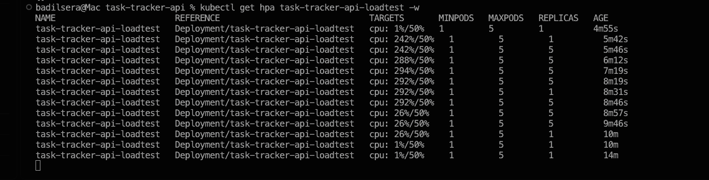
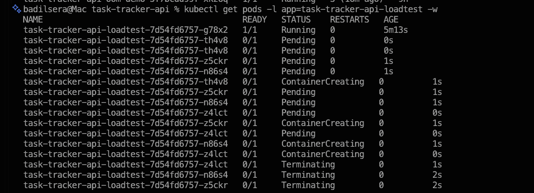
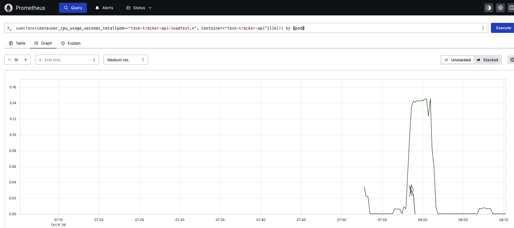

# Load Test: Horizontal Pod Autoscaling

**Status:** Verified
**Owner:** Serkan A.

## Summary

A CPU-based `HorizontalPodAutoscaler` was added to an isolated deployment
of `task-tracker-api` and exercised with a real concurrent load test. Under
load, the HPA scaled the deployment from 1 to 5 replicas (its configured
maximum), latency and CPU usage were measured before and during the test,
and the deployment scaled back down automatically once load stopped.

## System under test

| | |
|---|---|
| Workload | `task-tracker-api-loadtest` (plain `Deployment`, isolated from Scenarios 2 and 3) |
| CPU request / limit | `50m` / `150m` |
| HPA target | 50% average CPU utilization |
| HPA range | 1–5 replicas |
| Scale-down stabilization | 60s window, so the replica count doesn't collapse immediately when load drops |

Flask's built-in development server handles one request at a time per
process. Under concurrent load, a single pod's CPU use saturates its limit
well before it can serve requests any faster — additional replicas are
what actually increases throughput. This makes the test a realistic
demonstration of why horizontal scaling helps this kind of workload,
rather than a synthetic CPU-burn exercise.

## Load test

Run with [`hey`](https://github.com/rakyll/hey), 50 concurrent connections
against `/tasks` for 3 minutes:

```bash
hey -z 3m -c 50 http://localhost:8082/tasks
```

Result, against a single pod before the HPA reacted:

```
Status code distribution:
  [200] 13221 responses

Latency distribution:
  50% in 0.6535 secs
  90% in 0.7747 secs
  99% in 1.1647 secs
```

A p50 latency of ~650ms for a simple `GET /tasks` against an in-memory
SQLite query is the queueing effect of a single-threaded process handling
50 concurrent connections — not application slowness.

## Scaling behavior

`kubectl get hpa task-tracker-api-loadtest -w` during the test:

```
NAME                       REFERENCE                                TARGETS      MINPODS   MAXPODS   REPLICAS   AGE
task-tracker-api-loadtest  Deployment/task-tracker-api-loadtest      cpu: 1%/50%    1         5         1         4m55s
task-tracker-api-loadtest  Deployment/task-tracker-api-loadtest      cpu: 242%/50%  1         5         1         5m42s
task-tracker-api-loadtest  Deployment/task-tracker-api-loadtest      cpu: 242%/50%  1         5         5         5m46s
task-tracker-api-loadtest  Deployment/task-tracker-api-loadtest      cpu: 288%/50%  1         5         5         6m12s
task-tracker-api-loadtest  Deployment/task-tracker-api-loadtest      cpu: 294%/50%  1         5         5         7m19s
task-tracker-api-loadtest  Deployment/task-tracker-api-loadtest      cpu: 292%/50%  1         5         5         8m19s
task-tracker-api-loadtest  Deployment/task-tracker-api-loadtest      cpu: 26%/50%   1         5         5         8m57s
task-tracker-api-loadtest  Deployment/task-tracker-api-loadtest      cpu: 1%/50%    1         5         1         10m
```

The sequence is exactly what the configuration predicts: CPU usage crosses
the 50% target almost immediately once the load test starts (reaching
~290% of the *per-pod* target, since all load was initially concentrated
on the single existing pod), the HPA scales out to its configured maximum
of 5 replicas within seconds, and usage settles once the load is spread
across them. After the load test ends, CPU drops immediately but the
replica count holds at 5 for the 60-second stabilization window before
scaling back down to 1.



New pods going through `Pending` → `ContainerCreating` → `Running`, then
`Terminating` once load stopped and the HPA scaled back down:



Aggregate CPU usage across the deployment's pods, from Prometheus — a
sharp rise at the start of the load test and an equally sharp drop the
moment it ends:



## Conclusions

- The HPA reacted within the default metrics-server polling interval
  (well under a minute) and scaled to its configured ceiling under
  sustained load, with no manual intervention.
- The 60-second scale-down stabilization window behaved as configured —
  the replica count did not oscillate or collapse immediately when load
  dropped.
- For this workload shape (a single-threaded request server), horizontal
  scaling is the correct lever: a single pod cannot be made faster by a
  larger CPU limit alone, since it only ever processes one request at a
  time — more replicas is what increases effective concurrency.
